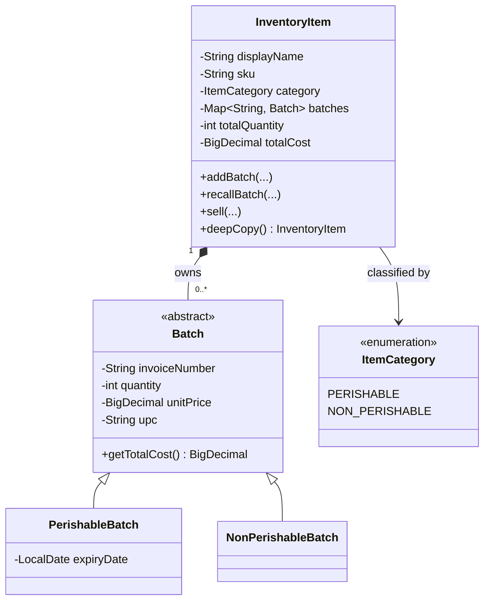
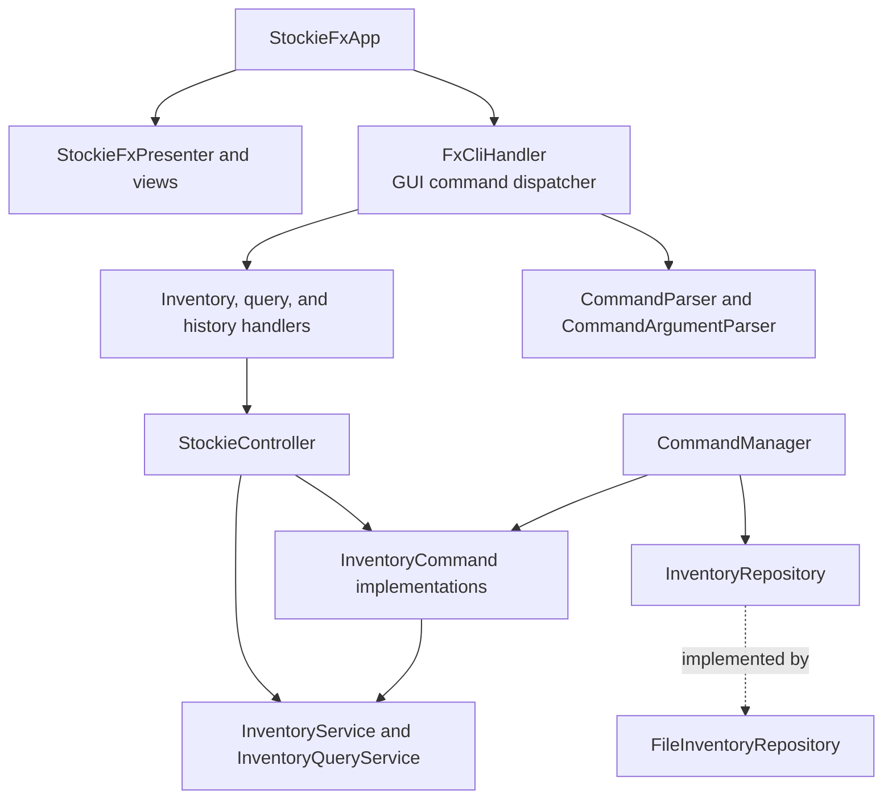
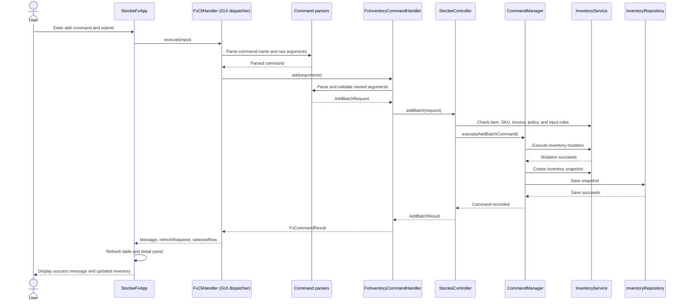
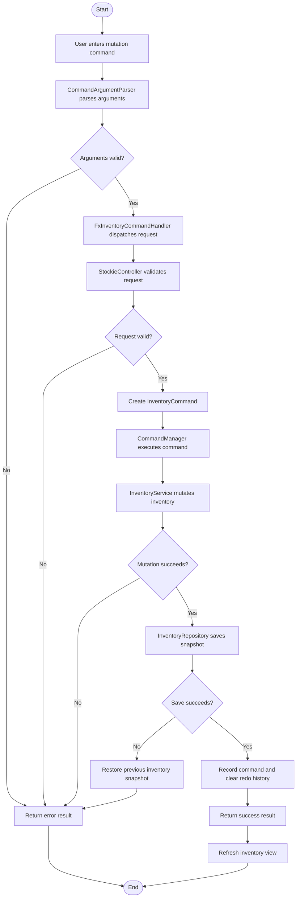
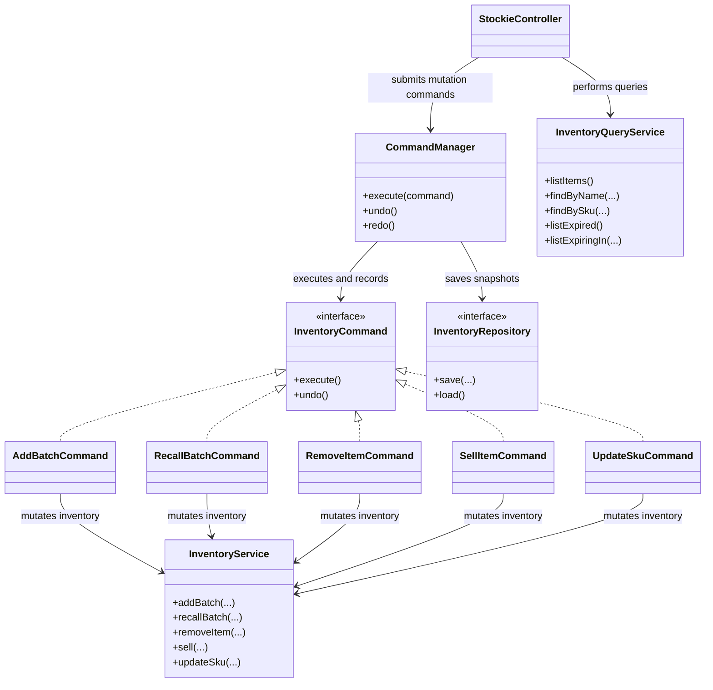

# Stockie Developer Guide

This guide explains how Stockie is structured, how to build and test it, and
where to make changes when adding or modifying features.

## Contents

- [Project overview](#1-project-overview)
- [Prerequisites](#2-prerequisites)
- [Setup](#3-setup)
- [Building and running](#4-building-and-running)
- [Source-code organisation](#5-source-code-organisation)
- [Architecture](#6-architecture)
- [Mutation flow](#7-mutation-flow)
- [Design](#8-design)
- [Important invariants](#9-important-invariants)
- [Testing](#10-testing)
- [Checkstyle and coding conventions](#11-checkstyle-and-coding-conventions)
- [Acknowledgements](#12-acknowledgements)

## 1. Project overview

Stockie is a JavaFX inventory workbench for invoice-based stock batches. The
application uses a layered design:

```text
JavaFX views and handlers
            |
            v
     StockieController
       /            \
      v              v
Commands       InventoryQueryService
      |                 |
      v                 v
CommandManager   InventoryService
      |
      v
InventoryRepository ----> FileInventoryRepository
```

Commands sit between the controller and the mutation service. They make
mutations undoable and allow `CommandManager` to maintain undo and redo
history.

## 2. Prerequisites

- JDK 25. The project is configured for Java 25 source and target compatibility.
- A working JavaFX-capable development environment.
- Gradle is supplied through the project wrapper, so a system Gradle
  installation is not required.

The main application class is:

```text
stockie.ui.javafx.StockieFxLauncher
```

## 3. Setup

### 3.1 Fork and clone the repository

1. Open the [Stockie repository](https://github.com/NUS-CS2103-AY2627-S1/cs3227-ip) on GitHub.
2. Click **Fork** and create a fork under your own GitHub account.
3. Clone your fork and enter the project directory:

   ```bash
   git clone https://github.com/<your-github-username>/cs3227-ip.git
   cd cs3227-ip
   ```

4. Add the original repository as `upstream` so that you can retrieve future
   updates:

   ```bash
   git remote add upstream https://github.com/NUS-CS2103-AY2627-S1/cs3227-ip.git
   git remote -v
   ```

### 3.2 Verify Java 25

Check both the Java runtime and compiler before running Gradle:

```bash
java -version
javac -version
```

Both commands should report version 25. If multiple JDKs are installed, set
`JAVA_HOME` to the JDK 25 installation.

On Windows PowerShell:

```powershell
$env:JAVA_HOME = 'C:\Program Files\Java\jdk-25.0.3'
java -version
javac -version
```

On macOS or Linux, use the path to your local JDK 25 installation:

```bash
export JAVA_HOME=/path/to/jdk-25
java -version
javac -version
```

### 3.3 Set up Gradle

Stockie uses the Gradle Wrapper committed in the repository. A separate
Gradle installation is not required. Verify the wrapper and its Java runtime:

On Windows:

```powershell
.\gradlew.bat --version
```

On macOS or Linux, make the wrapper executable once and then verify it:

```bash
chmod +x ./gradlew
./gradlew --version
```

The output should show Gradle 9.6.1 and JVM 25. The first invocation may
download the wrapper distribution and project dependencies.

### 3.4 Run a setup verification test

Run the test suite as the simplest end-to-end setup check:

```powershell
.\gradlew.bat test
```

```bash
./gradlew test
```

The command should finish with `BUILD SUCCESSFUL`. This verifies the JDK,
Gradle Wrapper, dependency resolution, Java compilation, and JUnit execution.
If this succeeds, the project is ready to run with the commands below.

### 3.5 Troubleshoot Gradle dependency locks

The VS Code Gradle integration can run a Gradle daemon while a terminal build
uses the same dependency cache. This can temporarily lock JavaFX or JUnit JARs
on Windows.

The workspace settings assign the VS Code Java/Gradle importer a separate
Gradle user home. After changing that setting, reload the VS Code window.
Terminal builds can continue using the repository cache:

```powershell
$env:GRADLE_USER_HOME = (Resolve-Path .gradle-user-home).Path
.\gradlew.bat --stop
.\gradlew.bat --no-daemon test
```

If a cache lock persists, close or reload VS Code, stop Gradle daemons, and
retry the build. Do not commit generated Gradle cache directories.

## 4. Building and running

From the repository root, use the Gradle wrapper.

On Windows:

```powershell
$env:JAVA_HOME = 'C:\Program Files\Java\jdk-25.0.3'
.\gradlew.bat build
.\gradlew.bat run
```

On macOS or Linux:

```bash
export JAVA_HOME=/path/to/jdk-25
./gradlew build
./gradlew run
```

The application uses `stockie-inventory.dat` in the working directory for
storing item data provided by users. This file is intentionally ignored by Git.

To create the distributable executable JAR, run:

```powershell
.\gradlew.bat shadowJar
```

```bash
./gradlew shadowJar
```

The resulting file is `build/libs/stockie.jar`. The `run` task is generally
more convenient during development because it configures the JavaFX runtime
from the Gradle dependencies automatically.

## 5. Source-code organisation

### `stockie.entities`

Contains the inventory domain model:

- `InventoryItem` stores an item name, SKU, category, and invoice-keyed
  batches.
- `Batch` is the common batch abstraction.
- `NonPerishableBatch` and `PerishableBatch` represent the two batch types.
- `ItemCategory` identifies whether an item is perishable.

`InventoryItem` owns batch-level operations such as adding, recalling, and
selling stock. It also provides deep-copy support for command history.

The complete source tree also contains these supporting packages:

- `stockie.application.request` contains request records passed into the
  controller.
- `stockie.application.result` contains result records returned by queries,
  mutations, and history operations.
- `stockie.application.exception` contains application-level exceptions such
  as `ItemNotFoundException`.
- `stockie.policy` contains application-wide limits such as
  `InventoryPolicy.MAX_ITEMS`.
- `stockie.util` contains shared utilities such as `TextNormalizer`.
- `stockie.ui.javafx.util` contains JavaFX presentation data and formatting
  helpers.
- `stockie.ui.javafx.view` contains reusable JavaFX view components.

#### Core entity class diagram



The model is designed around Stockie's intended use cases:

- Users need to find the same item through either its display name or SKU.
  The service therefore keeps a primary name index and a normalized SKU index,
  while `InventoryItem` stores the item's display values.
- Inventory can contain perishables such as food and medication, as well as
  non-perishables such as equipment. The `Batch` abstraction captures their
  shared fields, while the two subclasses allow expiry-specific behavior
  without adding expiry data to non-perishable batches.
- Stock is assumed to be procured from suppliers in batches. Each supplier
  provides a unique invoice number for a batch, so the item owns batches keyed
  by normalized invoice number. This prevents the same procurement batch from
  being added twice and gives recall operations an unambiguous target.

`InventoryItem` is the aggregate root for its batches: batch additions,
recalls, and sales go through the item so that batch contents and aggregate
quantity/cost totals remain consistent. Supplier details are not currently
modeled as a separate entity because the invoice number is the only supplier
identifier required by Stockie's current operations.

The indexes use the following representation rules:

| Value | Stored form | Lookup behavior |
| --- | --- | --- |
| Item name | Normalized map key; original display name retained | Case-insensitive |
| SKU | Normalized secondary index key; original SKU retained | Case-insensitive |
| Invoice number | Normalized batch map key; original invoice retained | Case-insensitive |

### `stockie.application.service`

- `InventoryService` owns mutable inventory state and maintains the maps keyed by item name
  and normalized SKU index.
- `InventoryQueryService` provides read-only queries such as listing depleted,
  expired, and expiring batches.

Use `InventoryService` for state changes and `InventoryQueryService` for
queries. Do not update the maps directly from UI code.

The application service is intentionally split into two services to reduce
the risk of accidental mutations during read operations. `InventoryService`
owns operations that change inventory, while `InventoryQueryService` exposes
non-mutating operations such as listing items and finding expired or expiring
batches.

Query commands therefore depend on `InventoryQueryService` instead
of the mutation service. This separation makes the intended behavior of each
operation explicit and prevents a query implementation from unintentionally
altering inventory state.

### `stockie.application.controller`

`StockieController` is the UI-independent application boundary. It:

- validates request-level input;
- resolves items by name or SKU;
- creates and executes commands;
- converts exceptions into result objects for the UI;
- exposes undo and redo operations.

User-triggered mutation methods return application results rather than leaking
storage or domain exceptions to JavaFX handlers. `load()` is an exception: it
propagates `IOException` and `ClassNotFoundException` so that the application
startup layer can report a failure to load persisted data.

### `stockie.application.command`

Each mutation is represented by an `InventoryCommand` implementation:

- `AddBatchCommand`
- `RecallBatchCommand`
- `RemoveItemCommand`
- `SellItemCommand`
- `UpdateSkuCommand`

`CommandManager` executes commands, saves successful changes, and records
only successful commands in history. A new successful command clears redo
history. Undo and redo also save the resulting inventory state.

Commands use defensive item snapshots so undo and redo do not depend on later
mutations to the same object.

### `stockie.storage`

`InventoryRepository` defines inventory storage operations. The current
implementation, `FileInventoryRepository`, serializes a `HashMap` snapshot to
disk.

Saving writes to a temporary file and then replaces the target file. Streams
must remain inside try-with-resources blocks. If atomic replacement is not
supported by the operating system, the repository falls back to ordinary
replacement semantics.

### `stockie.ui.javafx`

This package contains the active JavaFX user interface:

- `StockieFxApp` and `StockieFxLauncher` start the application.
- `StockieFxPresenter` coordinates views and controller results.
- `FxInventoryCommandHandler`, `FxInventoryQueryHandler`, and
  `FxHistoryCommandHandler` translate parsed commands into controller calls.
- `CommandArgumentParser` validates named arguments.
- `CommandResponseFormatter` produces user-facing output.

Keep command parsing and formatting in the UI command package. Keep inventory
rules in the controller or service layers so they remain testable without
launching JavaFX.

## 6. Architecture

### 6.1 Component view

The application is a JavaFX desktop application. `StockieFxApp` composes the
application objects at startup and owns the primary window. The UI delegates
commands to `FxCliHandler`, the GUI command dispatcher, which dispatches to
specialized handlers. Those handlers communicate with the UI-independent
controller.



The dependency direction is inward: UI classes depend on application classes,
application classes depend on domain services and abstractions, and the file
repository implements the storage abstraction. Domain and service code do not
depend on JavaFX.

### 6.2 Normal user-input sequence

The following sequence shows an `add` command entered in the JavaFX command
panel. Query, recall, sell, remove, SKU update, undo, and redo commands follow
the same outer path, with a different specialized handler or command.



If validation, mutation, or saving fails, the result travels back through
the same path with an error message. `CommandManager` rolls back a mutation if
the save fails, and the UI does not refresh because the result indicates that
no successful state change occurred.

### 6.3 Startup and inventory loading sequence

At startup, `StockieFxApp` creates a `FileInventoryRepository`, an
`InventoryService`, a `CommandManager`, and a `StockieController`. It then
calls `StockieController.load()`. The service validates the loaded snapshot,
deep-copies valid items, rebuilds the SKU index, and reports skipped entries.
The application displays the valid inventory and reports any skipped data to
the user.

Keeping repository creation at the application composition boundary makes the
controller and services straightforward to test with in-memory repositories.

### 6.4 Persistence and data-file lifecycle

`StockieFxApp` creates `FileInventoryRepository` with the path from the
`stockie.data.file` system property. If the property is not supplied, the
working-directory file `stockie-inventory.dat` is used. For example:

```powershell
.\gradlew.bat run -Dstockie.data.file=C:\\path\\to\\inventory.dat
```

```bash
./gradlew run -Dstockie.data.file=/path/to/inventory.dat
```

An absent or empty file is treated as an empty inventory. Saving serializes an
inventory snapshot to a temporary `.tmp` file, closes the output stream, and
then replaces the target file. The repository attempts an atomic replacement
and falls back to ordinary replacement when the operating system does not
support atomic moves.

During loading, `InventoryService` validates each item and its batches before
adding anything to the active indexes. Invalid entries and duplicate
normalized SKUs are skipped and reported to the caller. A failed load does not
partially rebuild the current indexes. Because the data format uses Java
serialization, changes to serializable classes may require compatibility
handling; see the serialization compatibility note in Section 8.7.

## 7. Mutation flow

The following Mermaid activity-style flow shows the complete flow for a GUI
mutation, including validation failures, persistence rollback, and history
recording:



The controller performs request-level validation and lookup. The service
enforces domain invariants. The command owns the reversible operation, while
the command manager controls saving and history. This separation prevents
UI code from mutating inventory directly.

## 8. Design

### 8.1 Data model responsibilities

The entity relationships are shown in the class diagram under
`stockie.entities` in Section 5. The service maintains a primary map keyed by
normalized item name and a secondary map keyed by normalized SKU, both pointing
to the same `InventoryItem`. Any operation that changes an item's SKU or
removes an item must update every affected index consistently.

### 8.2 Command and service structure

The following class diagram shows the static relationships between the
controller, commands, services, command manager, and repository. It
complements the sequence diagrams, which describe the order of interactions
during a specific operation.



The design separates responsibilities deliberately:

- `StockieController` is the application boundary. It validates requests and
  decides whether an operation is a query or a mutation.
- `InventoryCommand` implementations encapsulate reversible state changes.
- `CommandManager` coordinates command execution, saving inventory data, undo,
  and redo.
- `InventoryService` is used only for mutations.
- `InventoryQueryService` exposes read-only operations, reducing the risk that
  a query accidentally changes inventory state.
- `InventoryRepository` hides the inventory storage mechanism from commands and
  services.

The sequence diagrams explain how these classes interact over time, while this
diagram explains their ownership and dependency relationships.

### 8.3 Undo and redo flow

On a successful command, `CommandManager` records the command in the undo
stack and clears the redo stack. Undo restores the command's previous state
and moves it to the redo stack. Redo applies the command again and moves it
back to the undo stack.

If command execution or saving fails, the command is not recorded. A
failed command must also leave the inventory, indexes, and existing redo
history unchanged.

### 8.4 Command history state model

`CommandManager` maintains two LIFO stacks. The following table describes how
each operation changes them:

| Operation | Undo stack | Redo stack |
| --- | --- | --- |
| Successful new command | Push command | Clear all entries |
| Undo | Pop the latest command | Push that command |
| Redo | Push the reapplied command | Pop the latest command |
| Failed command or save | Unchanged | Unchanged |

Commands are recorded only after both execution and saving succeed. If saving
fails after a mutation, the command manager invokes the command's undo method
before returning the error. This keeps the in-memory inventory and its indexes
consistent with the last successfully saved state.

### 8.5 GUI execution model

JavaFX event handlers run on the JavaFX application thread. `StockieFxApp`
passes command-panel input to `FxCliHandler`, which parses the command name
and delegates to an inventory, query, or history handler. The handler calls
`StockieController` and returns an `FxCommandResult`.

`FxCommandResult` separates the user-visible message from presentation effects:

- `message` is appended to the command output or shown as a warning.
- `refreshRequired` tells the application to reload the current inventory
  view after a successful mutation or history operation.
- `selectedRow` tells the application to display a particular query result and
  update the detail panel.

The dashboard metrics follow the same selected expiry window used by the
expiring-items view. `StockieFxPresenter.refreshMetrics(int expiringInDays)`
queries the matching `ExpiringItem` results and sums the quantities of their
matching `PerishableBatch` objects for the **Expiring Soon** value. It does not
count the number of expiring or batches. `StockieFxApp` owns the selected window, which
defaults to 7 days, and updates the card caption after each refresh so it
matches the selected number of days.

Button-based actions in `StockieFxApp` use the same controller boundary as
command-panel actions. New UI behavior should therefore delegate to an
existing handler or controller operation instead of changing inventory state
directly in a view class.

Handler, parser, formatter, and presenter tests can run without launching a
JavaFX stage. Stage-level behavior should remain isolated from the
UI-independent service, controller, and command tests.

### 8.6 Error-handling strategy

The layers have different error responsibilities:

- Argument parsers reject malformed named arguments and invalid primitive
  formats.
- Handlers select the correct name or SKU lookup path and build UI results.
- The controller turns expected domain and persistence failures into result
  objects with user-facing messages.
- Services and entities throw exceptions when their programming or domain
  contracts are violated.
- Repository methods propagate `IOException` and
  `ClassNotFoundException` to their callers.

When adding a new error case, test the layer where the error is expected to be
handled. Do not make lower layers depend on JavaFX result types.

### 8.7 Extension points

The following file maps identify the usual production and test files involved
in extending Stockie. Files marked as conditional only need changes when the
new feature changes that layer's API or behavior.

#### Adding a new batch type

Production files:

- `src/main/java/stockie/entities/<NewBatchType>.java` — define the new batch
  subtype and its fields.
- `src/main/java/stockie/entities/Batch.java` — update the common abstraction
  only if the new type requires shared data or behavior.
- `src/main/java/stockie/entities/ItemCategory.java` — add a category only if
  the new type represents a new item classification.
- `src/main/java/stockie/entities/InventoryItem.java` — create, copy, sell,
  and otherwise process the new subtype where type-specific behavior is
  required.
- `src/main/java/stockie/application/service/InventoryService.java` — update
  category validation and persisted-data validation.
- `src/main/java/stockie/application/service/InventoryQueryService.java` —
  update query filters if the new type affects expiry or stock calculations.

Tests to add or update:

- `src/test/java/stockie/entities/BatchTest.java`
- `src/test/java/stockie/entities/InventoryItemTest.java`
- `src/test/java/stockie/application/service/InventoryServiceTest.java`
- `src/test/java/stockie/application/service/InventoryQueryServiceTest.java`
- `src/test/java/stockie/storage/FileInventoryRepositoryTest.java` — verify
  that the new serializable subtype survives save and load.
- `src/test/java/stockie/application/controller/StockieControllerTest.java` —
  verify request validation and user-visible behavior when applicable.

Generic commands do not normally require changes because they operate through
`InventoryService`. Their tests only need updates if the new type changes a
command's observable behavior.

> **Serialization compatibility note:** Changes to serializable classes can
> affect existing `stockie-inventory.dat` files. This includes adding,
> removing, or renaming fields; changing field types; changing inheritance; or
> adding new serializable subclasses. Preserve or deliberately update
> `serialVersionUID`, and add load tests for older or malformed data. Adding
> ordinary methods does not normally affect serialized data. Loaded data must
> be validated before active inventory indexes are rebuilt, so malformed data
> cannot partially modify the current inventory.

#### Adding an inventory storage backend

Production files:

- `src/main/java/stockie/storage/<New>InventoryRepository.java` — implement
  `InventoryRepository`.
- `src/main/java/stockie/storage/InventoryRepository.java` — change the
  interface only if the backend needs additional repository operations.
- `src/main/java/stockie/ui/javafx/StockieFxApp.java` — select and construct
  the backend at the application composition boundary.

`StockieController.java` and `CommandManager.java` should not need changes
when the new backend satisfies the existing `InventoryRepository` interface;
both already receive the abstraction through dependency injection. The
application services should likewise remain independent of concrete
repository implementations.

Tests to add or update:

- `src/test/java/stockie/storage/<New>InventoryRepositoryTest.java` — test the
  backend's save, load, empty-state, and failure behavior.
- `src/test/java/stockie/application/controller/StockieControllerTest.java` —
  verify controller behavior with the new repository when integration wiring
  differs.
- `src/test/java/stockie/application/command/CommandManagerTest.java` —
  verify persistence, undo, and redo behavior with the new backend when its
  failure semantics differ.

#### Adding a new GUI command

For a mutation, update these production files:

- `src/main/java/stockie/ui/javafx/command/CommandConstants.java` — add the
  command name and argument names.
- `src/main/java/stockie/ui/javafx/command/CommandMetadata.java` — register
  the command, its category, and its help description.
- `src/main/java/stockie/ui/javafx/FxCliHandler.java` — add the GUI command
  dispatch case for the command.
- `src/main/java/stockie/ui/javafx/command/CommandParser.java` — change this
  only if the new command introduces syntax beyond the existing generic
  command-name and argument parsing.
- `src/main/java/stockie/ui/javafx/command/CommandArgumentParser.java` — add
  argument validation when the command introduces new formats or rules.
- `src/main/java/stockie/ui/javafx/CommandHandlers/FxInventoryCommandHandler.java`
  or `src/main/java/stockie/ui/javafx/CommandHandlers/FxHistoryCommandHandler.java`
  — dispatch the command to the controller.
- `src/main/java/stockie/ui/javafx/command/CommandResponseFormatter.java` —
  format success and failure messages.
- `src/main/java/stockie/application/controller/StockieController.java` —
  validate the request and expose the application operation.
- `src/main/java/stockie/application/command/<NewCommand>.java` — implement
  the reversible mutation when the operation is not covered by an existing
  command.
- `src/main/java/stockie/application/service/InventoryService.java` — apply
  the domain mutation when new service behavior is required.

For a query, use
`src/main/java/stockie/ui/javafx/CommandHandlers/FxInventoryQueryHandler.java`,
`src/main/java/stockie/application/service/InventoryQueryService.java`, and
the relevant result class under `src/main/java/stockie/application/result/`
instead of the mutation command and mutation service files above. This may be
`FindQueryResult.java`, `ListQueryResult.java`, `ExpiringBatchQueryResult.java`,
or `ExpiringItem.java`, depending on the query's output. The query still
requires updates to `CommandMetadata.java` and `FxCliHandler.java` for
registration and GUI dispatch.

Tests to add or update:

- `src/test/java/stockie/ui/javafx/command/CommandArgumentParserTest.java`
- `src/test/java/stockie/ui/javafx/command/CommandResponseFormatterTest.java`
- `src/test/java/stockie/ui/javafx/FxCliHandlerTest.java` — verify GUI command
  registration, dispatch, and help output.
- `src/test/java/stockie/ui/javafx/CommandHandlers/FxInventoryCommandHandlerTest.java`
  or the relevant history/query handler test.
- `src/test/java/stockie/application/controller/StockieControllerTest.java`
- `src/test/java/stockie/application/command/<NewCommand>Test.java` and
  `CommandManagerTest.java` for mutations.
- `src/test/java/stockie/application/service/InventoryServiceTest.java` or
  `InventoryQueryServiceTest.java`, depending on the operation.
- `src/test/java/stockie/ui/javafx/command/CommandParserTest.java` — update
  only when the top-level command syntax changes; ordinary new command names
  do not require changes because parsing is generic.

Handler tests should verify malformed and missing arguments, successful and
failed operations, and the returned `refreshRequired` and `selectedRow`
values. Parser and formatter tests should remain isolated from JavaFX stage
launching.

#### Implementation workflow

For a new mutation, use this sequence:

1. Add or extend a domain operation in `InventoryItem` or `InventoryService`.
2. Add an `InventoryCommand` implementation with execute and undo behavior.
3. Add a controller method that validates input and maps failures to a result.
4. Add a JavaFX command handler path if the operation is user-facing.
5. Add tests at the service, command, controller, and handler boundaries.
6. Run `test`, `checkstyle`, and `check` before committing.

For a new query, add it to `InventoryQueryService`, expose it through the
controller, then add parser, handler, controller, and query-service tests as
appropriate.

## 9. Important invariants

When changing inventory behavior, preserve these rules:

- Item names and SKU lookups are case-insensitive through `TextNormalizer`.
- SKU index keys are normalized, while the item retains its display SKU.
- An item cannot exceed `InventoryPolicy.MAX_ITEMS` distinct items.
- A batch quantity must be positive.
- A batch price must not be null; controller input additionally rejects
  negative prices.
- A perishable item contains perishable batches, and a non-perishable item
  contains non-perishable batches.
- Invoice keys are normalized and must agree with their batch map keys.
- A failed mutation must not create an item, update indexes, or enter command
  history.
- Persisted data is validated before it is indexed; invalid entries are
  skipped by `InventoryService.load()`.

Use `InventoryPolicy` for application-wide limits rather than duplicating
literal values in controllers or tests.

## 10. Testing

Tests are under `src/test/java` and use JUnit 5.

### 10.1 Test boundaries and strategy

Test classes generally follow the production package structure, with each
layer tested at its own boundary:

- Entity tests verify batch behavior, totals, selling, recalling, and deep
  copies.
- Service tests verify item and SKU indexes, domain invariants, atomicity, and
  loading validation.
- Controller tests verify request validation, name/SKU lookup paths, result
  mapping, policy limits, and persistence-error handling.
- Command tests verify individual execute/undo behavior and command metadata.
- `CommandManagerTest` verifies persistence coordination, LIFO undo/redo
  behavior, snapshots, and history failure handling.
- Repository tests verify file save/load behavior, empty files, malformed
  data, and I/O failures.
- Handler, parser, formatter, and presenter tests verify GUI command
  translation without launching a JavaFX stage.

Expiry queries should use fixed dates in service-level tests where possible.
This avoids making assertions depend on the day on which the test happens to
run. Tests that exercise controller methods using `LocalDate.now()` should
clearly document that they are testing behavior relative to the current date.

Run the complete suite:

```powershell
$env:JAVA_HOME = 'C:\Program Files\Java\jdk-25.0.3'
.\gradlew.bat test
```

Run verification, including Checkstyle and JaCoCo coverage:

```powershell
.\gradlew.bat check
```

Useful focused commands include:

```powershell
.\gradlew.bat test --tests 'stockie.application.controller.StockieControllerTest'
.\gradlew.bat test --tests 'stockie.application.command.CommandManagerTest'
.\gradlew.bat test --tests 'stockie.storage.FileInventoryRepositoryTest'
```

UI tests that require launching a JavaFX stage are intentionally kept separate
from service and controller tests.

## 11. Checkstyle and coding conventions

Checkstyle is configured in `config/checkstyle/checkstyle.xml` and runs through
the Gradle `checkstyleMain` and `checkstyleTest` tasks.

Run it directly with:

```powershell
.\gradlew.bat checkstyleMain checkstyleTest
```

Modified Java code should follow the SE-EDU Java coding standard used by this
project: explicit imports, four-space indentation, braces for control flow,
clear method names, and Javadocs for public classes and non-obvious behavior.

## 12. Acknowledgements

Stockie is primarily project-authored code. The following libraries, build
tools, conventions, and external material are used or adapted in the project:

The repository source code was forked from the
[NUS CS3227 IP repository](https://github.com/NUS-CS2103-AY2627-S1/cs3227-ip).

| Library or source | Version | Use in Stockie |
| --- | --- | --- |
| [OpenJFX](https://openjfx.io/) | 24.0.2 | JavaFX application window, controls, layouts, and properties |
| [JUnit Jupiter](https://junit.org/junit5/) | 5.14.4 | Unit and integration testing API and test engine |
| [JUnit Platform Launcher](https://junit.org/junit5/) | 1.14.4 | Launching tests through Gradle and IDE integrations |
| [Gradle](https://gradle.org/) | 9.6.1 | Build automation, dependency management, application execution, and the Gradle Wrapper |
| [Shadow Gradle Plugin](https://github.com/GradleUp/shadow) | 9.5.1 | Producing the executable distribution JAR |
| [OpenJFX Gradle Plugin](https://github.com/openjfx/javafx-gradle-plugin) | 0.1.0 | Resolving and configuring JavaFX modules |
| [Checkstyle](https://checkstyle.org/) | 11.0.0 | Java style and static-format checks |
| [JaCoCo](https://www.jacoco.org/jacoco/) | Gradle-managed | Test coverage reports and coverage verification |
| [SE-EDU Java conventions](https://se-education.org/guides/conventions/java/intermediate.html) | — | Java naming, layout, documentation, and design conventions |
| [AddressBook Level 3 Checkstyle configuration](https://github.com/se-edu/addressbook-level3/tree/master/config/checkstyle) | — | Reference configuration for the project Checkstyle rules |
