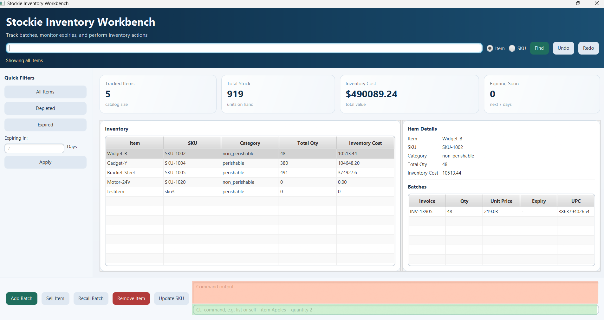
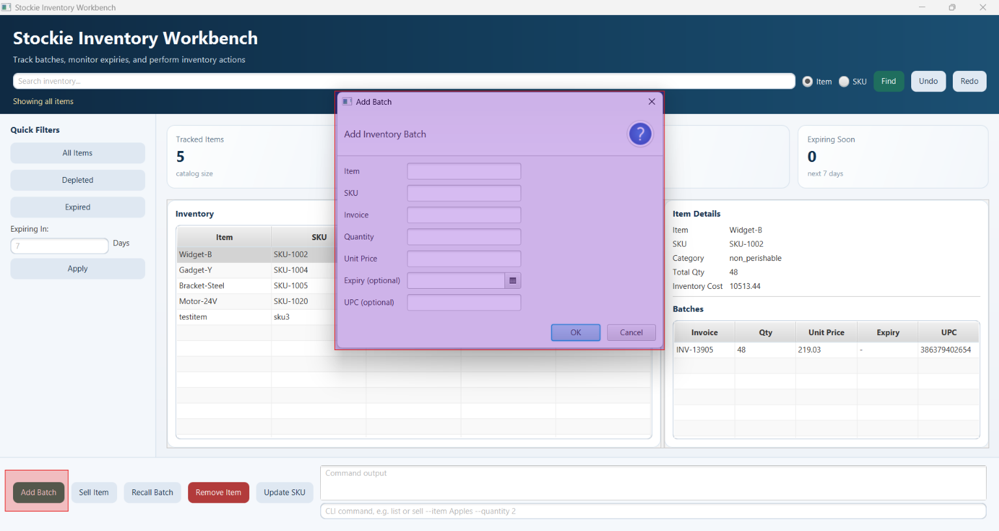
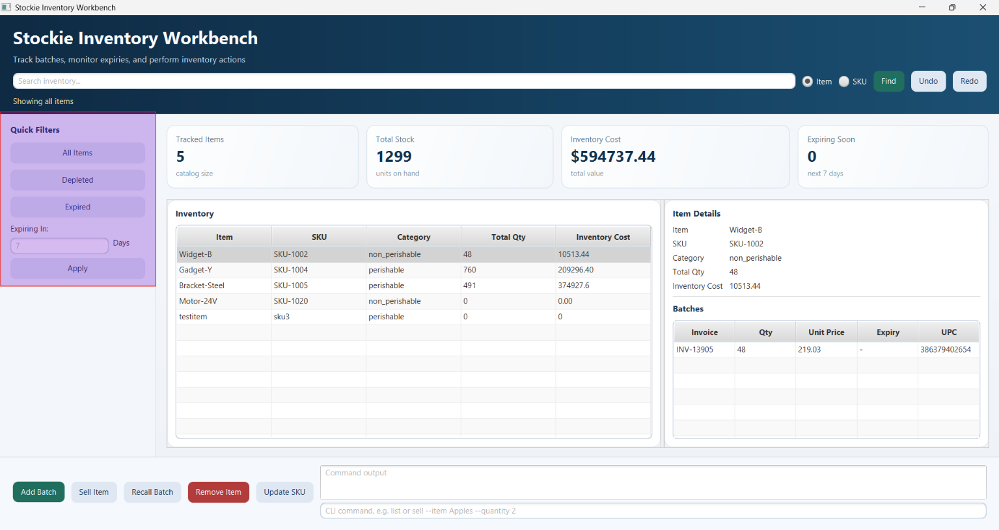
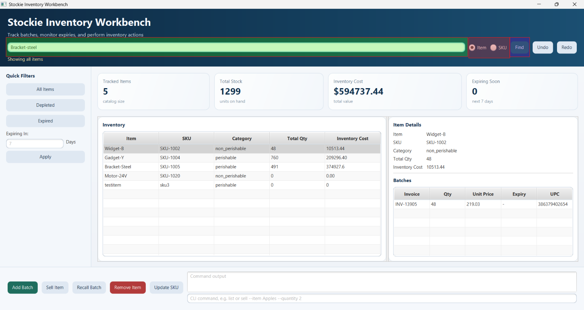
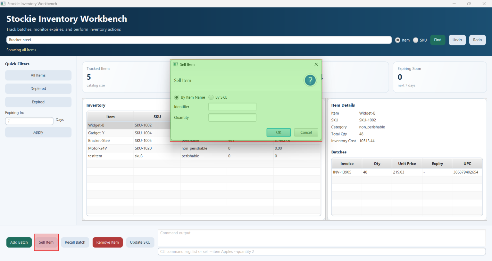
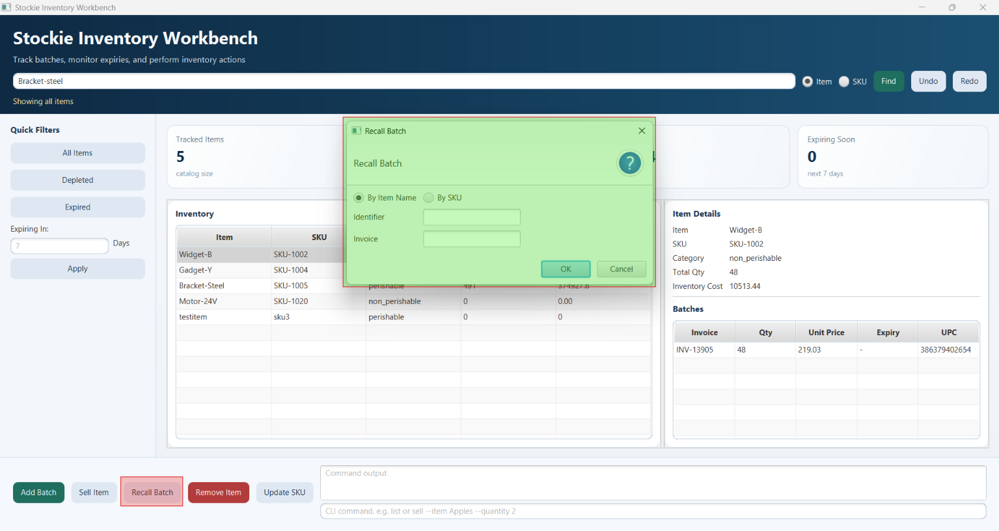
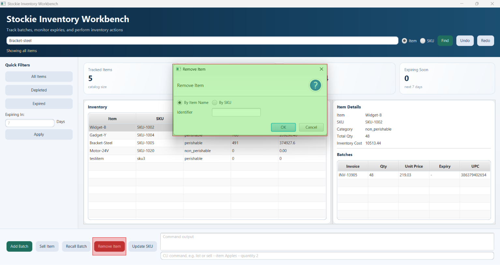
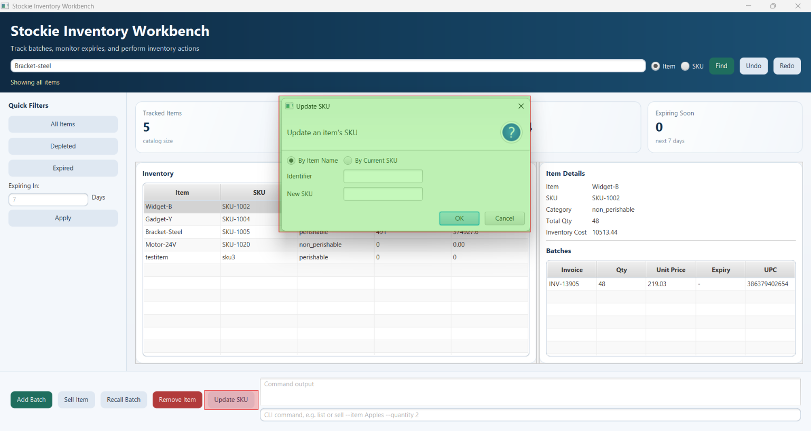
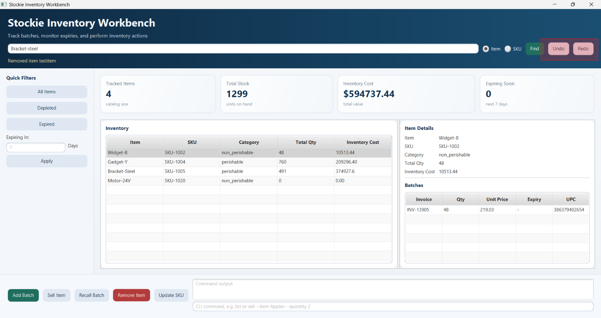

# Stockie User Guide

Stockie is an inventory workbench for tracking items as invoice-based batches. It records quantity, unit price, Stock Keeping Unit (SKU), optional UPC, and optional expiry dates. Inventory changes are saved automatically in `stockie-inventory.dat` in the working directory.

## Before You Start
> [!IMPORTANT]
> DO NOT modify the data files with the name `stockie-inventory.dat`. Doing so may result in unexpected behaviour when using Stockie and you may lose your data permanently. 

## Set Up and Run

**Requirements:** JDK 25

1. Verify that you have the correct Java version installed by opening Command Prompt (`Windows + R`, then type `cmd`) on Windows, or Terminal (from Applications) on Mac.

1. Type `java --version` into the command prompt or terminal. If the output shows `java version 25.x.x`, no further action is required. Otherwise, install JDK 25 from [Oracle's Official Website](https://www.oracle.com/java/technologies/javase/jdk25-archive-downloads.html) and follow the installation instructions.

    1. After installation, run `java --version` again to confirm the setup is complete.

<!-- TODO: add the release link here -->
1. Download the latest release of Stockie from [here]().

1. Open a command prompt or terminal and type `cd` followed by the location of the downloaded `.jar` file (e.g. `cd C:\Users\your_username\folder_name\`).

1. Type `java -jar` followed by the name of the `.jar` file (e.g. `java -jar stockie.jar`) and press Enter.

## JavaFX Workbench

The workbench provides a GUI for a clearer view of the managed inventory. You can interact with Stockie through either the GUI or the Command Line Interface (CLI).

The command sections below describe each feature in both CLI and GUI terms. Use the CLI format when entering commands in the command panel, or follow the GUI instructions when using the buttons and forms.

The features supported by Stockie are listed below:

### Inventory Management Actions
1. [Add a Batch](#add-a-batch)
1. [List Inventory](#list-inventory)
1. [Find an Item](#find-an-item)
1. [Sell Stock](#sell-stock)
1. [Recall a Batch](#recall-a-batch)
1. [Remove an Item](#remove-an-item)
1. [Update an SKU](#update-an-sku)
1. [Undo and Redo](#undo-and-redo)
1. [Help and Exit](#help-and-exit)

> [!NOTE]
> All fields (Name, SKU Number, Invoice Number, and UPC) are case insensitive.

## Command-Line Commands

For users who prefer the CLI, the available command formats are specified below.

Arguments are named fields and can be supplied in any order. A value continues until the next field is reached, so names containing spaces don't need to be wrapped in quotation marks. Field names, item names, and SKUs are all matched case-insensitively.

CLI commands can be used by typing into the text input highlighted in green, and the output is displayed in the display box highlighted in red.



### Notation

The notations below explain how CLI commands are described in this guide, to help you understand how to use them.

CLI commands generally follow this format:

`<command_name> --flag_1 <value_1> ...`

**Mandatory fields** — `--flag_name <value>`

A value must be provided after the flag for the command to work.
e.g. `--item Fanta` specifies the item name as `Fanta`.

**Optional fields** — `[--flag_name <value>]`

These fields can be omitted if they don't apply to your use case.

**Alternative fields** — `(--flag_1_name <value_1> | --flag_2_name <value_2>)`

One of the listed flags must be provided, but you may choose which one.
e.g. `(--item <name> | --sku <sku>)` means you can identify the item by either its name or its SKU.

### Add a Batch `add`

Add an item to be tracked by Stockie.

Required Fields: Name, SKU, Invoice Number, Quantity, Price.
Optional Fields: Expiry Date, UPC.

Quantity must be a positive whole number and price must be non-negative. An expiry date makes the batch perishable; without one, it is non-perishable.

Every item must have a unique name and SKU number. You are not allowed to add a new item that shares a name or SKU number already tracked by Stockie.

Every batch of the same item must have a unique invoice number.

This action can be undone.

> [!NOTE]
> Stockie will ask for a confirmation when adding an already expired batch.

#### CLI Usage

Command Format:
```text
add --item <name> --sku <sku> --invoice <invoice> --quantity <quantity> --price <price> [--expiry <dd-MM-yyyy>] [--upc <upc>]
```

#### GUI Usage

Click on `Add Item` button (highlighted in red), fill out the relevant fields (highlighted in purple) and click `OK` or press the enter key.



### List Inventory `list`

Stockie lets you view items filtered by the following categories:

- **All Items**
- **Depleted Items** — items with no stock available.
- **Expired Items**
- **Expiring Items** — items expiring within a specified number of days.

#### CLI Usage

Command Format:  

```text
list
list depleted
list expired
list expiring-in <days>
```

`list` shows all items, sorted by SKU.  
`list depleted` shows only items with zero quantity.  
`list expired` shows perishable batches whose expiry date is before today.  
`list expiring-in <days>` shows perishable batches expiring from today through the specified non-negative number of days, grouped by item and ordered by expiry date. Non-perishable items are excluded from expiry views.

#### GUI Usage

You may use the buttons here to display the different views of the inventory.  

To view expiring items, key in the number of days and click apply.



### Find an Item `find`

Stockie can help you to find a specific item by its Name or SKU. 

Required Fields: Name or SKU.

#### CLI Usage

Command Format:  

```text
find --item <name>
find --sku <sku>
```

#### GUI Usage

You can select to search by either **Name** or **SKU**, provide the value in the text input and click `find`.



### Sell Stock `sell`

Stockie can help to update the inventory count after the sales of items.

Required Fields: Name or SKU, Quantity.

The quantity must be positive and cannot exceed available stock. Stock is deducted from batches using the first in first out order. 

This action can be undone.

#### CLI Usage

Command Format:  

```text
sell (--item <name> | --sku <sku>) --quantity <quantity>
```

#### GUI Usage

Click on the `Sell Item` button and provide either the item Name or SKU Number, and the quantity sold.



### Recall a Batch `recall`

In the event that a batch of items is found to be defective and is returned or disposed of, Stockie can help to remove the entire batch from your inventory, and updates the new totals of the product.

Required Fields: Name or SKU, Invoice Number.

This action can be undone.

#### CLI Usage

Command Format:  

```text
recall (--item <name> | --sku <sku>) --invoice <invoice>
```

#### GUI Usage

Click on the `Recall Batch` button and provide either the item Name or SKU Number, and the invoice number.



### Remove an Item `remove`

Stockie can remove an item that is no longer managed in your inventory. You will be asked for confirmation before the item is removed.

Required Fields: Name or SKU.

> [!WARNING]
> This action can remove items that still have existing quantities. This is to support use cases where a product is being discontinued and will no longer be carried by your organisation.

#### CLI Usage

Command Format:

```text
remove (--item <name> | --sku <sku>)
```

#### GUI Usage

Click on the `Remove Item` button and provide either the Name or SKU Number.



### Update an SKU `update-sku`

Stockie can help to update the SKU for tracked items.

Required fields: Name or Old SKU, New SKU.

The new SKU must differ from the current SKU and must not already belong to another item. 

The change can be undone.

#### CLI Usage

Command Format:  

```text
update-sku (--item <name> | --current-sku <old-sku>) --sku <new-sku>
```

#### GUI Usage

Click on the `Update SKU` button and provide either the Name or Old SKU Number, and the New SKU Number.



### Undo and Redo `undo`, `redo`

Stockie can help to undo / redo the latest changes in the event of a mistake.

`undo` reverses the most recent successful add, sale, recall, removal, or SKU update.  
`redo` reapplies the most recently undone change.  

> [!NOTE]
> A new change clears the redo history. If no operation is available, Stockie reports `nothing to undo` or `nothing to redo`.

#### CLI Usage

Command Format: 

```text
undo
redo
```

#### GUI Usage

Click on the `undo` or `redo` button.



### Help and Exit `help`, `bye`

> [!NOTE]
> These are CLI exclusive commands.

`help` prints the supported commands.  
`bye` exits the CLI; in the JavaFX command panel it closes the application.

#### CLI Usage

Command Format:  

```text
help
bye
```


## Validation and Common Errors

Stockie rejects unknown, duplicate, empty, missing, or incorrectly formatted fields before changing inventory. For identifier-based commands, supply exactly one of the supported identifiers (`--item` or `--sku`; SKU updates use `--item` or `--current-sku`). Common errors include invalid quantity or price, insufficient stock, an existing SKU or invoice, an item/category or SKU mismatch, and an item or batch that cannot be found.

## Command Summary

| Command | CLI format |
| --- | --- |
| [Add a batch](#add-a-batch) | `add --item <name> --sku <sku> --invoice <invoice> --quantity <quantity> --price <price> [--expiry <dd-MM-yyyy>] [--upc <upc>]` |
| [List inventory](#list-inventory) | `list` |
| [List depleted items](#list-inventory) | `list depleted` |
| [List expired batches](#list-inventory) | `list expired` |
| [List expiring batches](#list-inventory) | `list expiring-in <days>` |
| [Find an item by name](#find-an-item) | `find --item <name>` |
| [Find an item by SKU](#find-an-item) | `find --sku <sku>` |
| [Sell stock](#sell-stock) | `sell (--item <name> \| --sku <sku>) --quantity <quantity>` |
| [Recall a batch](#recall-a-batch) | `recall (--item <name> \| --sku <sku>) --invoice <invoice>` |
| [Remove an item](#remove-an-item) | `remove (--item <name> \| --sku <sku>)` |
| [Update an SKU](#update-an-sku) | `update-sku (--item <name> \| --current-sku <old-sku>) --sku <new-sku>` |
| [Undo the latest change](#undo-and-redo) | `undo` |
| [Redo the latest undone change](#undo-and-redo) | `redo` |
| [Display help](#help-and-exit) | `help` |
| [Exit the CLI](#help-and-exit) | `bye` |
