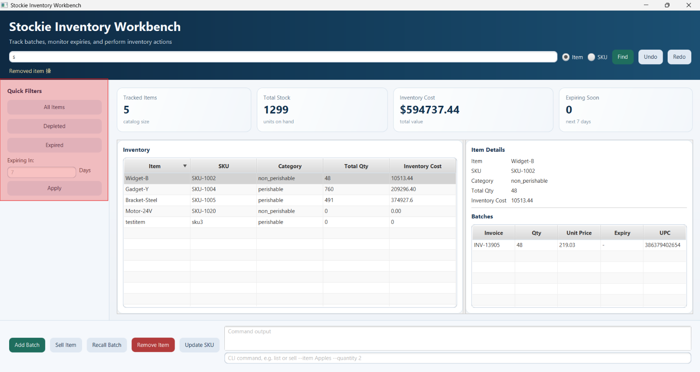
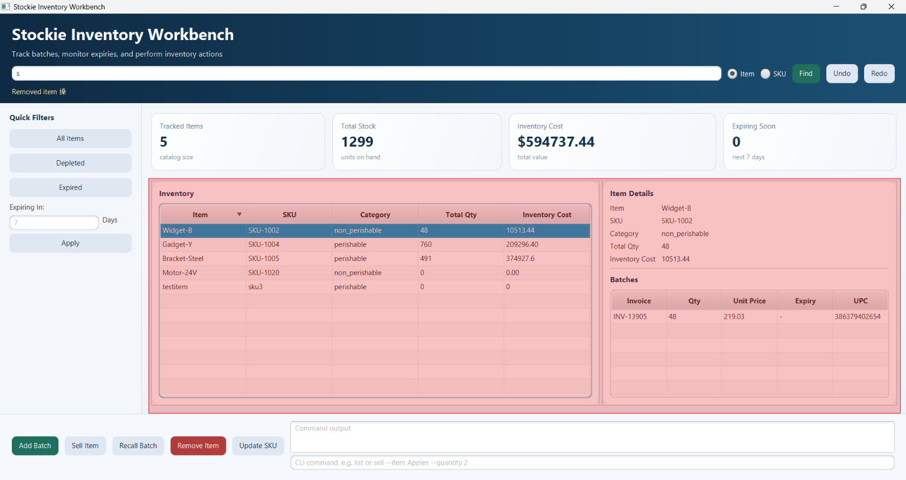
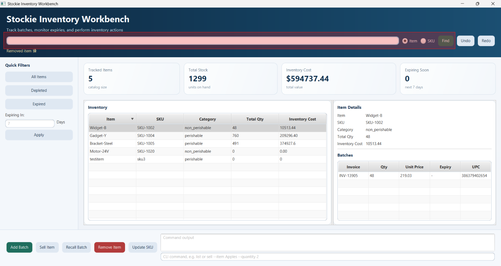
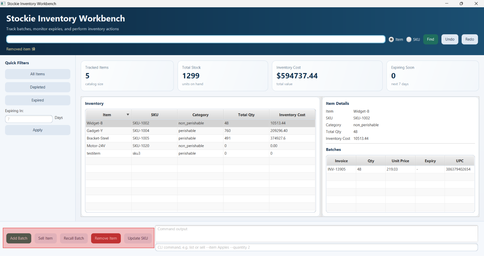
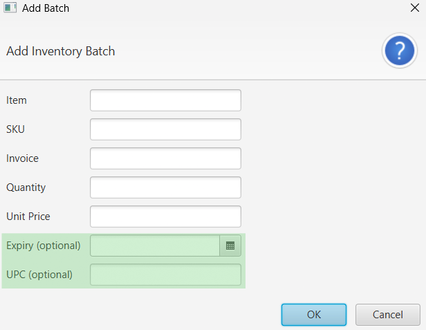
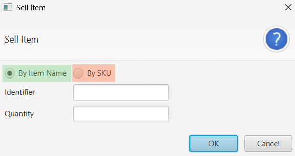

# Stockie User Guide

Stockie is an inventory workbench for tracking items as invoice-based batches. It records quantity, unit price, SKU, optional UPC, and optional expiry dates. Inventory changes are saved automatically in `stockie-inventory.dat` in the working directory.

## Before You Start
> [!IMPORTANT]
> DO NOT modify the data files with the name `stockie-inventory.dat`. Doing so may result in unexpected behaviour when using Stockie and you may lose your data permanently. 

## Set up and run

**Requirements:** JDK 25

1. Verify that you have the correct Java version installed by opening Command Prompt (`Windows + R`, then type `cmd`) on Windows, or Terminal (from Applications) on Mac.

1. Type `java --version` into the command prompt or terminal. If the output shows `java version 25.x.x`, no further action is required. Otherwise, install JDK 25 from [Oracle's Official Website](https://www.oracle.com/java/technologies/javase/jdk25-archive-downloads.html) and follow the installation instructions.

    1. After installation, run `java --version` again to confirm the setup is complete.

<!-- TODO: add the release link here -->
1. Download the latest release of Stockie from [here]().

1. Open a command prompt or terminal and type `cd` followed by the location of the downloaded `.jar` file (e.g. `cd C:\Users\your_username\folder_name\`).

1. Type `java -jar` followed by the name of the `.jar` file (e.g. `java -jar stockie.jar`) and press Enter.

## JavaFX workbench

The workbench provides dashboard cards for tracked items, total units, inventory cost, and items expiring in the selected window. It also provides quick filters for **All Items**, **Depleted**, **Expired**, and a user-specified positive number of days. 




Select an inventory-table row to view its SKU, category, totals, and batch details.



Use **Find** to search by item name or SKU; searches are case-insensitive. 



The **Add Batch**, **Sell Item**, **Recall Batch**, **Remove Item**, and **Update SKU** buttons open forms for those operations. **Undo** and **Redo** reverse or reapply changes. The command panel accepts the commands below; enter a command and press Enter.



Expired-batch additions and item removals require confirmation. Cancelling either confirmation leaves the inventory unchanged.

## Commands

Arguments are named fields and can be supplied in any order. A value continues until the next field is reached, so names containing spaces don't need to be wrapped in quotation marks. Field names, item names, and SKUs are all matched case-insensitively.


In the application's Graphical User Interface (GUI), command line commands can be used by typed into the text input highlighted in green, and the output is displayed in the display box highlighted in red.  

Alternatively, you may use the buttons on the GUI to make the changes as well. This guide will introduce the command line command for each feature first, before moving on to the GUI equivalent.

### Notation

The notations below explain how Command Line Commands are described in this guide, to help you understand how to use them.

Command Line Commands generally follow this format:

`<command_name> --flag_1 <value_1> ...`

**Mandatory fields** — `--flag_name <value>`

A value must be provided after the flag for the command to work.
e.g. `--item Fanta` specifies the item name as `Fanta`.

**Optional fields** — `[--flag_name <value>]`

These fields can be omitted if they don't apply to your use case.

> [!NOTE]
> In the GUI, optional fields are indicated with `(optional)`, as seen below.
> 

**Alternative fields** — `(--flag_1_name <value_1> | --flag_2_name <value_2>)`

One of the listed flags must be provided, but you may choose which one.
e.g. `(--item <name> | --sku <sku>)` means you can identify the item by either its name or its SKU.

> [!NOTE]
> In the GUI, you can indicate which field you are using by selecting the corresponding radio button.
> 

### List of Commands 
1. [Add a Batch](#add-a-batch)
1. [List Inventory](#list-inventory)
1. [Find an Item](#find-an-item)
1. [Sell Stock](#sell-stock)
1. [Recall a Batch](#recall-a-batch)
1. [Remove an Item](#remove-an-item)
1. [Update an SKU](#update-an-sku)
1. [Undo and Redo](#undo-and-redo)
1. [Help and Exit](#help-and-exit)


### Add a Batch `add`

```text
add --item <name> --sku <sku> --invoice <invoice> --quantity <quantity> --price <price> [--expiry <dd-MM-yyyy>] [--upc <upc>]
```

The five fields without brackets are required. Quantity must be a positive whole number and price must be non-negative. An expiry date makes the batch perishable; without one, it is non-perishable.  
> [!NOTE]
> Dates use `dd-MM-yyyy`.  
> Adding an already expired batch asks for `yes` or `no` confirmation.

```text
add --item milk --sku SKU-MILK --invoice INV001 --quantity 5 --price 2.75 --expiry 31-12-2026 --upc 012345678901
```

An item keeps one SKU and one category across all its batches. Invoice numbers must be unique for that item, and a new item cannot reuse an existing SKU.

### List Inventory `list`

```text
list
list depleted
list expired
list expiring-in <days>
```

`list` shows all items, sorted by SKU.  
`list depleted` shows only items with zero quantity.  
`list expired` shows perishable batches whose expiry date is before today.  
`list expiring-in <days>` shows perishable batches expiring from today through the specified non-negative number of days, grouped by item and ordered by expiry date. Non-perishable items are excluded from expiry views.

### Find an Item `find`

```text
find --item <name>
find --sku <sku>
```

The result includes the item’s category, total quantity, inventory cost, and every batch.

### Sell Stock `sell`

```text
sell (--item <name> | --sku <sku>) --quantity <quantity>
```

The quantity must be positive and cannot exceed available stock. Stock is deducted from batches and the affected invoice quantities are reported. The operation is saved and can be undone.

### Recall a Batch `recall`

```text
recall (--item <name> | --sku <sku>) --invoice <invoice>
```

This removes the complete batch identified by the item and invoice, reports updated totals, and can be undone.

### Remove an Item `remove`

```text
remove (--item <name> | --sku <sku>)
```

This removes the item and all its batches after confirmation. The operation can be undone.

### Update an SKU `update-sku`

```text
update-sku (--item <name> | --current-sku <old-sku>) --sku <new-sku>
```

The new SKU must differ from the current SKU and must not already belong to another item. The change can be undone.

### Undo and Redo `undo`, `redo`

```text
undo
redo
```

`undo` reverses the most recent successful add, sale, recall, removal, or SKU update.  
`redo` reapplies the most recently undone change.  
> [!NOTE]
> A new change clears the redo history. If no operation is available, Stockie reports `nothing to undo` or `nothing to redo`.

### Help and Exit `help`, `bye`

```text
help
bye
```

`help` prints the supported commands.  
`bye` exits the CLI; in the JavaFX command panel it closes the application.

## Validation and common errors

Stockie rejects unknown, duplicate, empty, missing, or incorrectly formatted fields before changing inventory. For identifier-based commands, supply exactly one of the supported identifiers (`--item` or `--sku`; SKU updates use `--item` or `--current-sku`). Common errors include invalid quantity or price, insufficient stock, an existing SKU or invoice, an item/category or SKU mismatch, and an item or batch that cannot be found.

## Testing

Run the automated tests with:

```powershell
.\gradlew.bat test
```

Manual console test cases are in [`test/ui-test-plan.md`](../test/ui-test-plan.md). They cover adding and recalling batches, expiry queries, depleted filtering, finding by name and SKU, validation, selling, removing, SKU updates, and undo/redo. Start the CLI with `runCli`, enter each case line by line, and compare the output with its expected output. Use a separate temporary data file for repeatable tests so earlier runs do not affect later cases.

## Command Summary

| Command | CLI format |
| --- | --- |
| [Add a batch](#add-a-batch) | `add --item <name> --sku <sku> --invoice <invoice> --quantity <quantity> --price <price> [--expiry <dd-MM-yyyy>] [--upc <upc>]` |
| [List inventory](#list-inventory) | `list` |
| [List depleted items](#list-inventory) | `list depleted` |
| [List expired batches](#list-inventory) | `list expired` |
| [List expiring batches](#list-inventory) | `list expiring-in <days>` |
| [Find an item by name](#find-an-item) | `find --item <name>` |
| [Find an item by SKU](#find-an-item) | `find --sku <sku>` |
| [Sell stock](#sell-stock) | `sell (--item <name> \| --sku <sku>) --quantity <quantity>` |
| [Recall a batch](#recall-a-batch) | `recall (--item <name> \| --sku <sku>) --invoice <invoice>` |
| [Remove an item](#remove-an-item) | `remove (--item <name> \| --sku <sku>)` |
| [Update an SKU](#update-an-sku) | `update-sku (--item <name> \| --current-sku <old-sku>) --sku <new-sku>` |
| [Undo the latest change](#undo-and-redo) | `undo` |
| [Redo the latest undone change](#undo-and-redo) | `redo` |
| [Display help](#help-and-exit) | `help` |
| [Exit the CLI](#help-and-exit) | `bye` |
